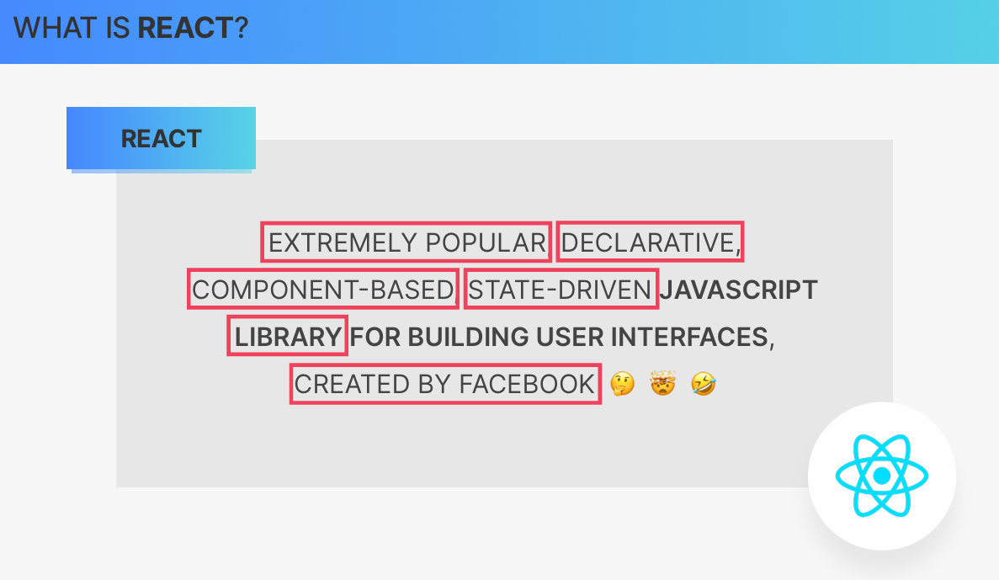
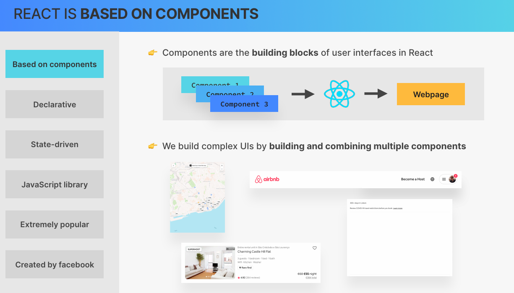
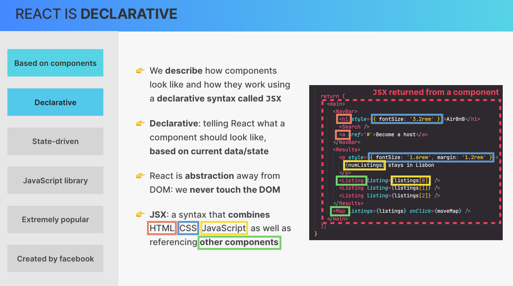
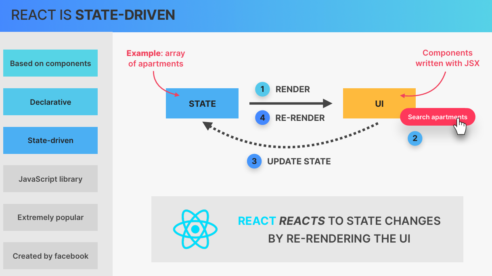
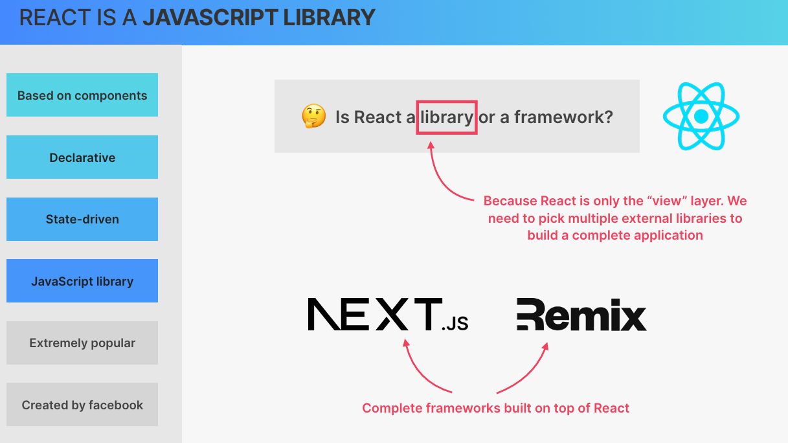
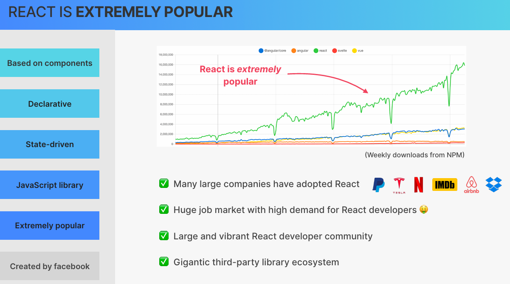
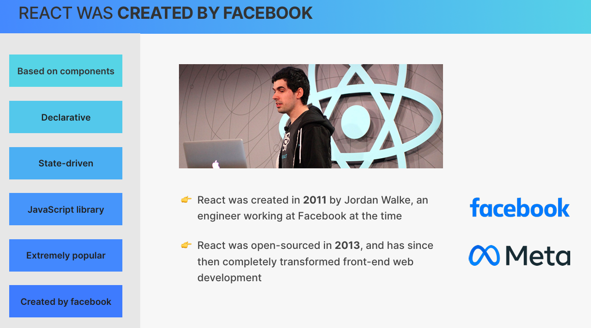
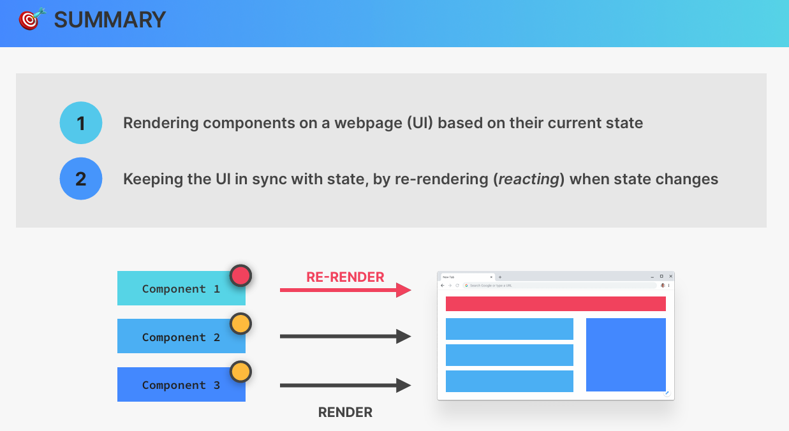

# React

Es una biblioteca de **JavaScript** creada para construir interfaces de usuario (UI), especialmente aplicaciones web interactivas.



## 01. Based on components



React está basado en componentes.

Los componentes son los bloques de construcción de las interfaces
de usuario.

Una aplicación compleja se puede dividir en componentes pequeños,
reutilizables y combinables.

Por ejemplo:

``` jsx

function App() {
  return (
    <>
      <Navbar />
      <Main />
      <Footer />
    </>
  );
}

```

## 02. Declarative



React es declarativo porque describimos cómo debe verse la interfaz
según los datos o el estado actual, en lugar de indicar manualmente
cada paso para modificar el DOM.

Por ejemplo:

``` javascript

function App() {
  const [count, setCount] = useState(0);

  return <h1>{count}</h1>;
}

```

Aquí describimos que el contenido del `h1` debe ser el valor actual
de `count`.

Cuando el estado cambia, React actualiza la interfaz para que
coincida con el nuevo estado.

### Imperativo vs declarativo

#### Imperativo:

Significa que le decimos al programa qué pasos concretos debe seguir para conseguir un resultado.

``` javascript

document.querySelector('h1').textContent = 'Hola';

```

- Indicamos directamente cómo modificar el DOM.

#### Declarativo:

Significa que describimos qué resultado queremos obtener, sin tener que especificar todos los pasos necesarios para modificar la interfaz.

``` HTML

<h1>Hola</h1>

```

Describimos cómo queremos que se vea la interfaz.

| Imperativo                                       | Declarativo                                       |
| ------------------------------------------------ | ------------------------------------------------- |
| Describimos los pasos para conseguir un resultado. | Describimos el resultado que queremos.               |
| Manipulamos directamente elementos del DOM.        | Describimos la interfaz mediante componentes y JSX. |
| Controlamos las operaciones de actualización.   | React se encarga de actualizar la interfaz.       |


### JSX

JSX es una sintaxis que permite escribir estructuras parecidas a
HTML dentro de JavaScript.

Permite describir elementos de la interfaz, utilizar expresiones
de JavaScript y referenciar otros componentes.

React normalmente se encarga de actualizar el DOM, por lo que no
necesitamos manipularlo directamente en la mayoría de los casos.

## 03. State-driven



React es **state-driven** porque la interfaz de usuario depende del
estado actual de la aplicación.

Podemos pensar en la interfaz como una función del estado:

``` text

UI = f(state)

```

Es decir, dado un determinado estado, React renderiza la interfaz
que corresponde a ese estado.

### Renderizado y re-renderizado

        STATE
          │
          │ render
          ▼
          UI
          │
          │ interacción
          ▼
     UPDATE STATE
          │
          │
          └──────────────► RE-RENDER
                              │
                              ▼
                              UI


Cuando un componente se renderiza por primera vez, React calcula la
UI que corresponde al estado actual.

Cuando el estado cambia mediante una función como `setCount`, React
vuelve a ejecutar el componente para obtener la nueva descripción de
la UI.

Esto se conoce como re-rendering.

El objetivo es mantener la UI sincronizada con el estado.

## 04. JavaScript library



React es una biblioteca de JavaScript.

Una biblioteca es un conjunto de código reutilizable que podemos utilizar para resolver determinados problemas.

En el caso de React, su función principal es ayudarnos a construir y gestionar la interfaz de usuario.

React se centra principalmente en la capa de UI.

Por eso, para construir una aplicación completa podemos combinar React con otras herramientas y bibliotecas.

Por ejemplo:

                 Aplicación web
                       │
          ┌────────────┼────────────┐
          ↓            ↓            ↓
        React       Router        API
          │
          ↓
         UI

También existen frameworks que utilizan React como parte de su sistema, como **Next.js**.

**React se centra principalmente en construir la UI; no pretende proporcionar por sí solo todas las herramientas necesarias para cualquier tipo de aplicación.**

## 05. Extremely popular


React es una de las tecnologías más utilizadas para construir interfaces web.

Su popularidad ha producido un ecosistema muy grande alrededor de React.

Por ejemplo, alrededor de React podemos encontrar herramientas para:

    React
    ├── Routing
    ├── State management
    ├── Forms
    ├── Data fetching
    ├── UI components
    ├── Animations
    └── Testing

## 06. Created by Facebook



React fue creado por Jordan Walke, un ingeniero que trabajaba en Facebook.

El proyecto comenzó alrededor de 2011 y posteriormente fue presentado públicamente.

React fue open-source en 2013, permitiendo que desarrolladores externos pudieran utilizarlo, estudiarlo y contribuir a su desarrollo.

Desde entonces, React se convirtió en una de las tecnologías más importantes para el desarrollo de interfaces web.

Facebook posteriormente pasó a llamarse Meta, por lo que actualmente React forma parte del ecosistema de proyectos de Meta.

