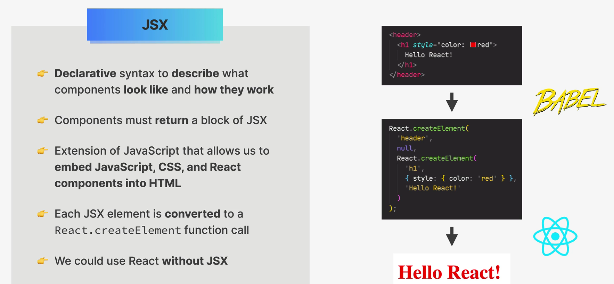

# JSX



JSX es una sintaxis que permite escribir estructuras parecidas a
HTML dentro de JavaScript.

Permite describir elementos de la interfaz, utilizar expresiones
de JavaScript y referenciar otros componentes.

React normalmente se encarga de actualizar el DOM, por lo que no
necesitamos manipularlo directamente en la mayoría de los casos.

JSX permite mezclar:

- JavaScript

- elementos HTML

- CSS mediante style

- componentes de React

Por ejemplo:

``` javascript

function App() {
  const nombre = "Pepe";

  return (
    <div>
      <h1>Hola {nombre}</h1>
      <Mensaje />
    </div>
  );
}

```

Aquí hay JavaScript:

``` javascript

const nombre = "Pepe";

```

y JSX:

``` jsx

<div>
  <h1>Hola {nombre}</h1>
  <Mensaje />
</div>

```

## 1. Pero el navegador no entiende JSX directamente

Aquí entra Babel.

El navegador entiende JavaScript, HTML y CSS, pero JSX necesita ser transformado a JavaScript.

Babel es una herramienta que puede transformar este:

``` javascript

<header>
  <h1>Hello React!</h1>
</header>

```

en algo equivalente a código JavaScript como:

``` javascript

React.createElement(
  "header",
  null,
  React.createElement(
    "h1",
    null,
    "Hello React!"
  )
);

```

Es decir, el `h1` se convierte en el tercer argumento del `createElement` de `header`.

Por eso la diapositiva dice:

- Each JSX element is converted to a `React.createElement` function call

## 2. ¿Qué significa `React.createElement`?

React tiene una función llamada:

``` javascript

React.createElement()

```

que crea una representación de un elemento de React.

Por ejemplo:

``` javascript

React.createElement("h1", null, "Hola");

```

le está diciendo conceptualmente a React:

- Quiero crear un elemento h1 cuyo contenido sea Hola.

La estructura básica es:

``` javascript

React.createElement(
  tipo,
  props,
  hijos
);

```

Por ejemplo:

``` javascript

React.createElement(
  "h1",
  { className: "titulo" },
  "Hola Mundo"
);

```

Ejemplo:

```

"h1"
  ↓
tipo de elemento

{ className: "titulo" }
  ↓
props

"Hola Mundo"
  ↓
children

```

## 3. `null`

(Este ejemplo lleva la palabra `header`)

``` javascript

React.createElement(
  "header",
  null,
  ...
);

```

Ese null corresponde a los props.

Como header no tiene props:

    <header>

no hay nada que pasarle, así que:

    null

Por ejemplo, si tenemos:

``` javascript

<h1 className="titulo">
  Hola
</h1>

```

Babel conceptualmente puede transformarlo en:

``` javascript

React.createElement(
  "h1",
  { className: "titulo" },
  "Hola"
);

```

Ahora sí tenemos props.

## 4. ¿Qué es Babel y por qué Babel hace esto?

1. Babel es una herramienta que transforma código JavaScript moderno y JSX en JavaScript que puede ser ejecutado por el entorno donde correrá la aplicación.

2. Lo hace porque React necesita trabajar con JavaScript.

Nosotros podemos escribir:

``` javascript

function App() {
  return (
    <div>
      <h1>Hola Mundo</h1>
      <button>Click</button>
    </div>
  );
}

```

en lugar de tener que escribir manualmente:

``` javascript

function App() {
  return React.createElement(
    "div",
    null,
    React.createElement(
      "h1",
      null,
      "Hola Mundo"
    ),
    React.createElement(
      "button",
      null,
      "Click"
    )
  );
}

```
Esta segunda forma es mucho más incómoda.

**JSX existe principalmente para que nosotros podamos escribir React de una manera mucho más legible.**

**Nota:**

- **React** → biblioteca para construir interfaces.

- **JSX** → sintaxis que usamos para escribir interfaces de React de forma cómoda.

- **Babel** → herramienta que transforma JSX (y otras características de JavaScript) a código JavaScript.