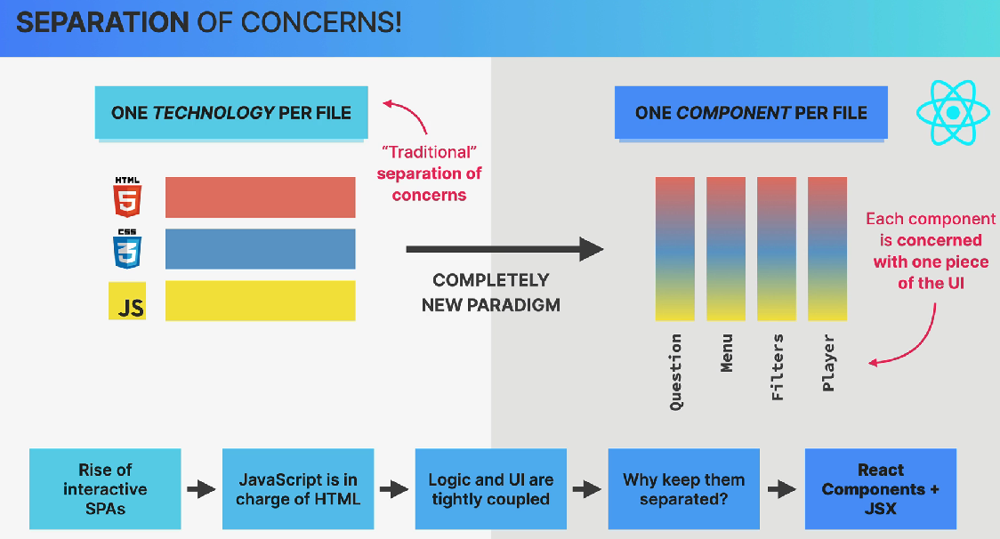

# Separation of Concerns (SoC).

La clave es que React no elimina la separación de responsabilidades, sino que propone separarlas de una manera diferente.

**Entonces ahora propone separar en diferentes responsabilidades para que cada parte del código se encargue de una cosa concreta.**



Por lo general antes así era la estructura de una aplicación:

- HTML → estructura

- CSS  → estilos

- JS   → comportamiento

Y normalmente eso terminaba separado también por archivos:

- index.html

- style.css

- script.js

### Ejemplo:

`index.html`

``` HTML

<button id="btn">Click</button>

```

`style.css`

``` CSS

button {
  background: blue;
}

```

`script.js`

``` javascript

document
  .getElementById("btn")
  .addEventListener("click", () => {
    console.log("Clicked");
  });

```

Aquí estamos separando por tecnología:

    HTML
    CSS
    JavaScript

Eso es lo que la imagen llama:

- **ONE TECHNOLOGY PER FILE**

## 1. React propone otra forma

React dice:

- En una aplicación moderna, ¿por qué separar HTML, CSS y JavaScript si los tres están trabajando juntos para construir una misma parte de la interfaz?

### Ejemplo.

Una aplicación de un restaurante y tiene un menú, tiene esta estructura:

            MENU
    ┌─────────────────┐
    │ Home            │
    │ Products        │
    │ About           │
    └─────────────────┘

El menú necesita:

- HTML → estructura

- CSS → apariencia

- JavaScript → comportamiento

Pero los **tres pertenecen al mismo concepto: el menú**.

Entonces React propone organizar la aplicación alrededor de **componentes**.

    components/
    │
    ├── Menu.jsx
    ├── Player.jsx
    ├── Filters.jsx
    └── Question.jsx

Cada componente contiene todo lo necesario para representar una parte de la interfaz.

### Por eso la diapositiva dice "One Component Per File"

Por ejemplo:

``` javascript

function Menu() {
  return (
    <div className="menu">
      <button>Home</button>
      <button>Products</button>
    </div>
  );
}

```

Ese componente tiene:

    Menu
    │
    ├── JSX → estructura
    ├── JavaScript → lógica
    └── CSS → estilos relacionados

Todo lo relacionado con Menu en un solo lugar.

## 2. React mezcla todo

Sí, pero con una separación diferente.

Lo tradicional era:


          APLICACIÓN

      ┌──── HTML ────┐
      ├──── CSS ─────┤
      └──── JS ──────┘

Separar todo por tecnología.

React propone:

          APLICACIÓN
              │
       ┌──────┼──────┐
       ↓      ↓      ↓
     Menu   Player  Filters
       │      │      │
       │      │      │
     JSX    JSX    JSX
     JS     JS     JS
     CSS    CSS    CSS

Separación por **componente/parte de la UI**.

## 3. ¿Por qué tiene sentido?

Porque en una aplicación interactiva, la lógica y la interfaz suelen estar muy relacionadas.

### Esto conecta directamente con [JSX](03.%20jsx.md)

Ahora se entiende mejor por qué JSX es tan importante.

React te permite escribir:

``` javascript

function Question() {
  const question = "¿Cuál es la capital de Francia?";

  return (
    <div>
      <h2>{question}</h2>
      <button>Responder</button>
    </div>
  );
}

```

Aquí existe en un mismo componente:

    JavaScript
        +
       JSX
        +
      React

Y ese componente representa una **pieza concreta de la interfaz**.

## Resumen

React sigue el principio de **Separation of Concerns**, pero en lugar de separar principalmente por tecnología (HTML, CSS y JavaScript), organiza la aplicación alrededor de componentes, donde cada componente representa una pieza específica de la UI y contiene la lógica relacionada con ella.

En otras palabras:

**La separación debe hacerse alrededor de las responsabilidades de la UI, no necesariamente alrededor de las tecnologías utilizadas.**

    COMPONENTES
        ↓
    Cada componente representa una parte de la UI
        ↓
    JSX describe cómo debe verse
        ↓
    JavaScript controla la lógica
        ↓
    React mantiene UI y estado sincronizados
