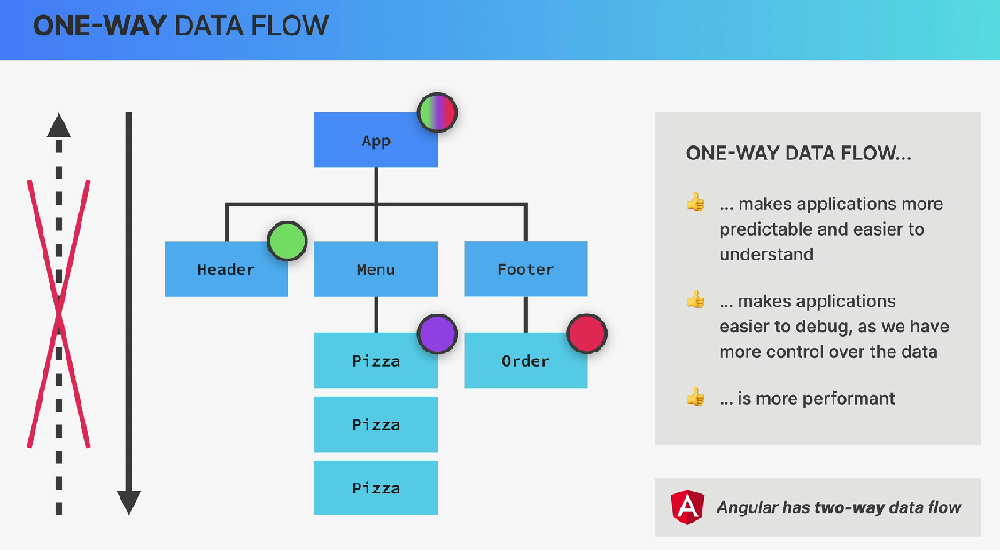
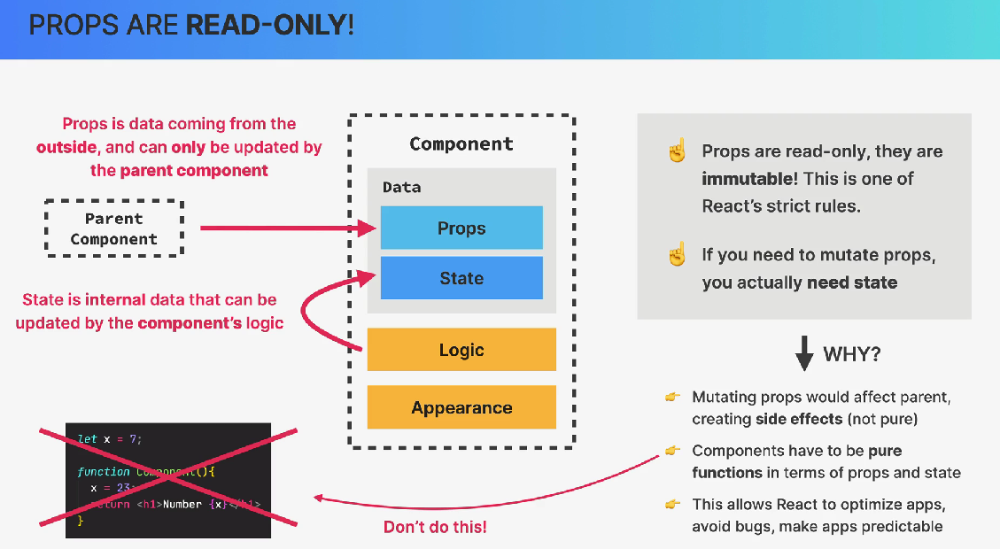

# Props (properties)

Los props son los argumentos que un componente recibe.

En JavaScript:

``` javascript

function saludar(nombre) {
  return `Hola ${nombre}`;
}

saludar("Carlos");

```

`nombre` es un dato que le estamos pasando a la función.

En React ocurre algo parecido:

``` javascript

function Saludo({ nombre }) {
  return <h1>Hola {nombre}</h1>;
}

```

Y desde el componente padre:

``` javascript

<Saludo nombre="Carlos" />

```

Aquí:

    Padre
      │
      │ nombre="Carlos"
      ↓
    Saludo

`nombre` es un **prop**.

## 1. One-Way Data FLow

### Props = datos que bajan

Los **Props** se usan para pasar información de un componente padre a un componente hijo.



Es decir:

    Componente padre
          │
          │ props
          ↓
    Componente hijo

## 2. Props son de solo lectura



Si recibe:

``` javascript

function Usuario({ nombre }) {

```

no deberíamos hacer:

``` javascript

nombre = "Pedro"; // ❌

```

El componente hijo no debe modificar directamente el prop que recibió.

### ¿Por qué?

Porque el dato pertenece al padre.

Por ejemplo:

    App
    │
    │ nombre = "Ana"
    ↓
    Usuario

Usuario puede leer "Ana".

Pero no puede decir:

- Ahora `nombre` será `Pedro`.

El cambio debe venir desde arriba.

## Destructuración de Props

Como **prop**s es un objeto, podemos utilizar la desestructuración de objetos de JavaScript:

``` javascript

function Message({ count }) {
  return <p>Has leído {count} avisos</p>;
}

```

Esto:

``` javascript

{ count }


```

significa:

- De todas las propiedades que hay dentro del objeto props, dame la propiedad count.

Es conceptualmente equivalente a:

``` javascript

function Message(props) {
  const { count } = props;

  return <p>Has leído {count} avisos</p>;
}

```

La diferencia es que podemos hacerlo directamente en los parámetros de la función:

``` javascript

function Message({ count }) {
  ...
  }

```

## También podemos mezclar desestructuración con otras props

Por ejemplo:

``` javascript

function User({ name, age, ...otherProps }) {
  console.log(name);
  console.log(age);
  console.log(otherProps);

  return <div>{name}</div>;
}

```

Si recibieramoss:

``` javascript

<User
  name="Pepe"
  age={25}
  email="..."
  city="Guatemala"
/>

```

tendríamos:

``` javascript

name = "Pepe"
age = 25


otherProps = {
  email: "...",
  city: "Guatemala"
}

```

Ese `...otherProps` utiliza el `rest` operator de JavaScript.