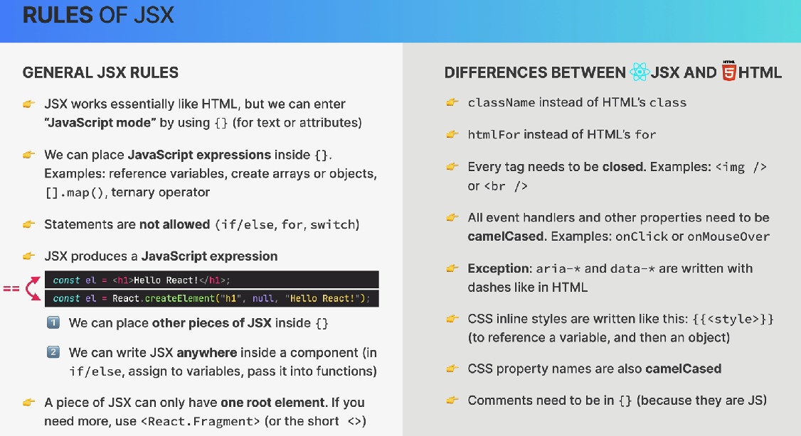

# Reglas de JSX

JSX se parece a HTML, pero realmente es una sintaxis que permite escribir elementos de UI dentro de JavaScript.



## 1. Podemos entrar en "JavaScript mode" con `{}`

Por ejemplo:

``` javascript

const name = "Pepe";

const element = <h1>Hola {name}</h1>;

```

React termina mostrando:

``` javascript

Hola Pepe

```

## 2. ¿Qué podemos poner dentro de `{}`?

Se puede poner **expresiones** de JavaScript, que estas producen un valor.

Por ejemplo:

``` javascript

const name = "Pepe";

<h1>Hola {name}</h1>

```

Una operación:

``` javascript

<p>{10 + 5}</p>

```

Un ternario:

``` javascript

<p>{age >= 18 ? "Adulto" : "Menor"}</p>

```

Un `.map()`:

``` javascript

const fruits = ["Manzana", "Banana", "Naranja"];

<ul>
  {fruits.map((fruit) => (
    <li>{fruit}</li>
  ))}
</ul>

```

Un objeto:

``` javascript

const user = {
  name: "Bryan",
  age: 25
};

```

Y poder acceder a sus propiedades:

``` javascript

<p>{user.name}</p>

```

## 3. Pero NO podemos poner statements dentro de `{}`

**Statement**

Es una instrucción que ejecuta una acción:

    if (...) { ... }
    for (...) { ... }
    switch (...) { ... }

Estos no pueden ponerse directamente dentro de `{}` en JSX.

### ❌ Esto no funciona:

``` javascript

<h1>
  {if (age >= 18) {
    "Adulto"
  }}
</h1>

```

Porque `if` es un `statement`, no una expresión.

En cambio, si podemos utilizar un operador ternario:

``` javascript

<h1>
  {age >= 18 ? "Adulto" : "Menor"}
</h1>

```

Porque el ternario sí es una expresión.

## 4. JSX produce una expresión de JavaScript

Esta parte de la imagen es importante.

Cuando ponemos:

``` javascript

const el = <h1>Hello React!</h1>;

```

JSX no es HTML que el navegador entiende directamente.

Babel lo transforma en algo como:

``` javascript

const el = React.createElement(
  "h1",
  null,
  "Hello React!"
);

```

Es decir:

``` javascript

<h1>Hello React!</h1>

```

termina representando un valor de JavaScript.

Por eso podemos hacer cosas como:

``` javascript

const element = <h1>Hola</h1>;

```

Y después:

``` javascript

console.log(element);

```

`element` es un valor que React puede utilizar para construir la interfaz.

## 5. Podemos colocar JSX dentro de `{}`

Ejemplo:

``` javascript

const message = <h1>Hola Pepe</h1>;

return (
  <div>
    {message}
  </div>
);

```

Aquí tenemos:

``` javascript

{message}

```

y `message` contiene JSX.

También podemos hacer:

``` javascript

const showMessage = true;

return (
  <div>
    {showMessage && <h1>Hola Pepe</h1>}
  </div>
);

```

Esto es muy común en React.

## 6. Podemos escribir JSX prácticamente en cualquier lugar dentro de un componente

Como JSX es una expresión de JavaScript, podemos asignarlo a una variable:

``` javascript

const title = <h1>Mi aplicación</h1>;

```

Podemos utilizarlo en un `if` indirectamente:

``` javascript

let content;

if (isLoggedIn) {
  content = <h1>Bienvenido</h1>;
} else {
  content = <h1>Inicia sesión</h1>;
}

return <div>{content}</div>;

```

**IMPORTATE**

❌ No metimos el `if` dentro de `{}`.

``` javascript

{if (...) ...}

```

Lo que hicimos fue ejecutar el `if` normalmente en JavaScript y luego meter el resultado JSX:

``` javascript

{content}

```

También podemos pasar JSX a una función:

``` javascript

function showMessage(element) {
  return <div>{element}</div>;
}

const message = <h1>Hola</h1>;

showMessage(message);

```

## 7. Un bloque de JSX solamente puede tener un elemento raíz

Esto es otra regla fundamental.

❌ Esto no es válido:

``` javascript

return (
  <h1>Hola</h1>
  <p>¿Cómo estás?</p>
);

```

¿Por qué?

Porque tiene dos elementos raíz:

    <h1>
    <p>

Necesita un elemento que los contenga:

``` javascript

return (
  <div>
    <h1>Hola</h1>
    <p>¿Cómo estás?</p>
  </div>
);

```

Ahora hay un único elemento raíz:

    div
    ├── h1
    └── p

## 8. Pero no siempre queremos crear un `<div>`

Para eso existe:

``` javascript

<React.Fragment>
  <h1>Hola</h1>
  <p>¿Cómo estás?</p>
</React.Fragment>

```

Y existe la forma abreviada:

``` javascript

<>
  <h1>Hola</h1>
  <p>¿Cómo estás?</p>
</>

```

Esto se llama **Fragment**.

La ventaja es que React puede agrupar esos elementos sin agregar un elemento HTML innecesario al DOM.

---

# Ahora las diferencias con HTML


## 1. `className` en lugar de `class`

En HTML:

``` HTML

<div class="container">

```

En JSX:

``` javascript

<div className="container">

```

¿Por qué?

Porque JSX está dentro de JavaScript y `class` tiene un significado especial en JavaScript.

Por eso React utiliza:

``` javascript

className

```

## 2. `htmlFor` en lugar de `for`

HTML:

``` HTML

<label for="email">

```

JSX:

``` javascript

<label htmlFor="email">

```

La razón es similar: `for` también es una palabra reservada/construcción de JavaScript.

## 3. Todos los elementos tienen que cerrarse

En HTML se puede escribir:

``` HTML


```

Pero en JSX se debe cerrarlo:

``` javascript


```

Lo mismo:

``` HTML

<br>

```

en JSX:

``` javascript

<br />

```

Y tambén para los elementos normales:

``` javascript

<p>Hola</p>

```

Esto tiene sentido porque JSX necesita una estructura bien definida.

## 4. Los eventos utilizan `camelCase`

HTML:

``` HTML

<button onclick="...">

```

JSX:

``` javascript

<button onClick={...}>

```

Otros ejemplos:

``` javascript

onMouseOver
onChange
onSubmit
onKeyDown

```

## 5. Excepción: `aria-*` y `data-*`

Aquí hay una pequeña excepción a la regla de camelCase.

Podemos escribir:

``` javascript

<button
  aria-label="Cerrar"
  data-id="123"
>
  X
</button>

```

Es decir:

    aria-label
    data-id

con guiones.

Esto se debe a que `aria-*` y `data-*` son atributos estandarizados de HTML.

## 6. CSS inline tiene una sintaxis particular

Esta parte suele ser confusa.

En HTML podríamos escribir:

``` HTML

<div style="color: red; font-size: 20px;">

```

Pero en JSX:

``` javascript

<div style={{ color: "red", fontSize: "20px" }}>

```

### ¿Por qué hay dos `{}`?

Porque cada uno tiene un propósito diferente.

#### Primer `{}`

Entra en JavaScript:

``` javascript

style={ ... }

```

Le estamos diciendo a JSX:

- El valor de style viene de JavaScript.

#### Segundo `{}`

Es el objeto JavaScript:

``` javascript

{
  color: "red",
  fontSize: "20px"
}

```

Por eso:

``` javascript

style={{
  color: "red",
  fontSize: "20px"
}}

```

podemos visualizarlo así:

    style={
          {
            color: "red",
            fontSize: "20px"
          }
    }
    ↑       ↑
    JS      objeto

Y otra diferencia:

HTML/CSS:

``` CSS

font-size

```

JSX:

``` javascript

fontSize

```

Las propiedades CSS en objetos JavaScript se escriben normalmente en **camelCase**.

## 7. Los comentarios tienen una sintaxis diferente

En JavaScript:

``` javascript

// comentario

```

En JSX no se puede hacer esto directamente:

❌

``` javascript

<div>
  // Esto es un comentario
  <h1>Hola</h1>
</div>

```

En JSX se debe utilizar:

``` javascript

<div>
  {/* Esto es un comentario */}
  <h1>Hola</h1>
</div>

```

Porque:

``` javascript

{/* comentario */}

```

significa:


- entrar en JavaScript → escribir un comentario → salir de JavaScript.

## Resumen

3 reglas principales

### 1. JSX parece HTML

``` javascript

<h1>Hola</h1>

```

pero realmente es una expresión de JavaScript que React/Babel puede transformar.

### 2. `{}` significa "aquí entra JavaScript"

``` javascript

<h1>Hola {name}</h1>

```

Se puede poner expresiones, no statements:

``` javascript

{name}
{10 + 5}
{condition ? "Sí" : "No"}
{items.map(...)}

```

pero no:

``` javascript

{if (...) {}}
{for (...) {}}

```

### 3. JSX tiene reglas propias respecto a HTML

Principalmente:

``` javascript

className
htmlFor
onClick
onChange

<br />
style={{ ... }}
{/* comentario */}

```

Y además ` <> </>`:

``` javascript

<>
  <h1>Hola</h1>
  <p>Mundo</p>
</>

```

para tener múltiples elementos sin añadir un `<div>`.